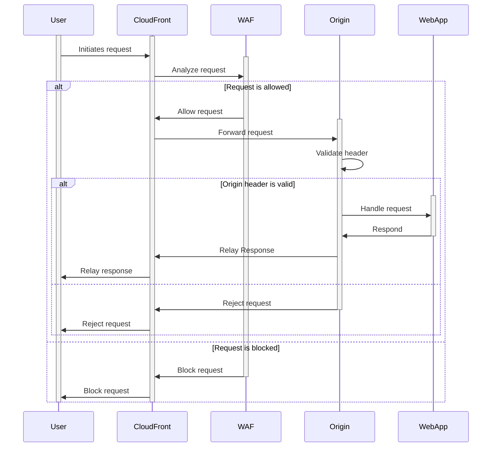

# Architecture

Tax benefits applications are deployed as containers to an [Aptible]
environment. These containers connect to a [PostgreSQL] container for data
storage, and [Amazon S3][s3] for file storage.

The applications are exposed to the internet through an Aptible endpoint, which
is protected by an [AWS Web Application Firewall (WAF)][waf] and a
[CloudFront] distribution.

```mermaid
architecture-beta
  group aws(fab:aws)[AWS Cloud]
  group aptible(fas:cloud)[Aptible]

  service user(far:circle-user)[User]

  service distribution(logos:aws-cloudfront)[CloudFront Distribution] in aws
  service waf(logos:aws-waf)[Web Application Firewall] in aws
  service s3(logos:aws-s3)[S3 Bucket] in aws

  service endpoint(logos:aws-elb)[Origin Endpoint] in aptible
  service allowlist(fas:magnifying-glass)[Header Verification] in aptible
  service containers(fas:server)[Application Containers] in aptible
  service database(logos:postgresql)[Database] in aptible

  user:R --> L:distribution
  distribution:B --> T:waf
  distribution:R --> L:endpoint
  endpoint:B --> T:allowlist
  endpoint:R --> L:containers
  containers:B --> T:database
  containers:T -- T:s3
```

## Tagging

All AWS resources should include the following tags:

| Key           | Desdcription                                     | Values                          |
|---------------|--------------------------------------------------|---------------------------------|
| `project`     | The name of the project the resource belongs to. | `ctc`, `fyst`, `gyr`, `gry-es`  |
| `environment` | The environment the resource is deployed in.     | `demo`, `production`, `staging` |

## Web Application Firewall

When a request is made to an application, it first passed through the WAF. The
WAF checks the request against a set of rules to determine if it is malicious,
and either allows or blocks the request based on the results.

> [!TIP]
> The WAF can be configured to override the default behavior and count requests
> rather than blocking them. This is useful for monitoring traffic without
> affecting the application, and can be used to fine-tune the WAF rules before
> enforcing them.

The WAF will block requests that meet the following criteria:

* **[IP Reputation][rules-ip-rep]**: The request is from an IP address with a
  poor reputation.
* **[Common Threats][rules-common]**: The request matches a known pattern for
  common threats, such as the [OWASP Top 10][owasp].
* **[Known Bad Inputs][rules-inputs]**: The request contains inputs that are
  known to be invalid, or are associated with malicious behavior.
* **[SQL Injection][rules-sqli]**: The request contains SQL injection attacks.
* **[Excess Requests][rules-rate] (rate limiting)**: The request exceeds the
  rate limit set for the application.

If a request does not match any of these criteria, it is allowed to pass through
to the origin endpoint in Aptible.

A request can be exempted from the WAF through an [IP matching][rules-ip-match]
rule. This is currently configured for certain environments that are used for
[security scanning][scanners].

## Origin Endpoint

> [!WARNING]
> Although the endpoint is managed by OpenTofu, Aptible still requires a user to
> click the "records have been created" button in the Aptible dashboard to
> complete the setup.
>
> Additionally, the `x-origin-token` header value can only be set through the
> dashboard.

The origin endpoint is an [HTTPS managed endpoint][aptible-endpoint] in Aptible
that is only accessible from the CloudFront distribution. This endpoint is the
entry point for requests to the application, and is responsible for routing
requests to the appropriate containers.

The domain for the endpoint is the same as the domain for the CloudFront, with
an `origin.` prefix. For example, if the CloudFront domain is `my-project.org`,
the origin endpoint domain would be `origin.my-project.org`.

To ensure that only traffic from CloudFront is allowed to access the origin, we
set add a `x-origin-token` header in the request. If the header is missing or
invalid, the request is rejected. This allows us to prevent direct access to the
origin and bypassing the WAF.

## DNS

All domains used for tax applications are configured in [Route 53][route53].
Records for the WAF and CloudFront are managed by OpenTofu and are created
automatically when the infrastructure is deployed. This includes records for TLS
validation.

[aptible]: https://www.aptible.com/
[aptible-endpoint]: https://www.aptible.com/docs/core-concepts/apps/connecting-to-apps/app-endpoints/https-endpoints/overview
[cloudfront]: https://aws.amazon.com/cloudfront/
[owasp]: https://owasp.org/www-project-top-ten/
[postgresql]: https://www.postgresql.org/
[route53]: https://aws.amazon.com/route53/
[rules-common]: https://docs.aws.amazon.com/waf/latest/developerguide/aws-managed-rule-groups-baseline.html#aws-managed-rule-groups-baseline-crs
[rules-inputs]: https://docs.aws.amazon.com/waf/latest/developerguide/aws-managed-rule-groups-baseline.html#aws-managed-rule-groups-baseline-known-bad-inputs
[rules-ip-match]: https://docs.aws.amazon.com/waf/latest/developerguide/waf-rule-statement-type-ipset-match.html
[rules-ip-rep]: https://docs.aws.amazon.com/waf/latest/developerguide/aws-managed-rule-groups-ip-rep.html#aws-managed-rule-groups-ip-rep-amazon
[rules-rate]: https://docs.aws.amazon.com/waf/latest/developerguide/waf-rule-statement-type-rate-based-request-limiting.html
[rules-sqli]: https://docs.aws.amazon.com/waf/latest/developerguide/aws-managed-rule-groups-use-case.html#aws-managed-rule-groups-use-case-sql-db
[s3]: https://aws.amazon.com/s3/
[scanners]: ../usage/security-scans.md
[waf]: https://aws.amazon.com/waf/
